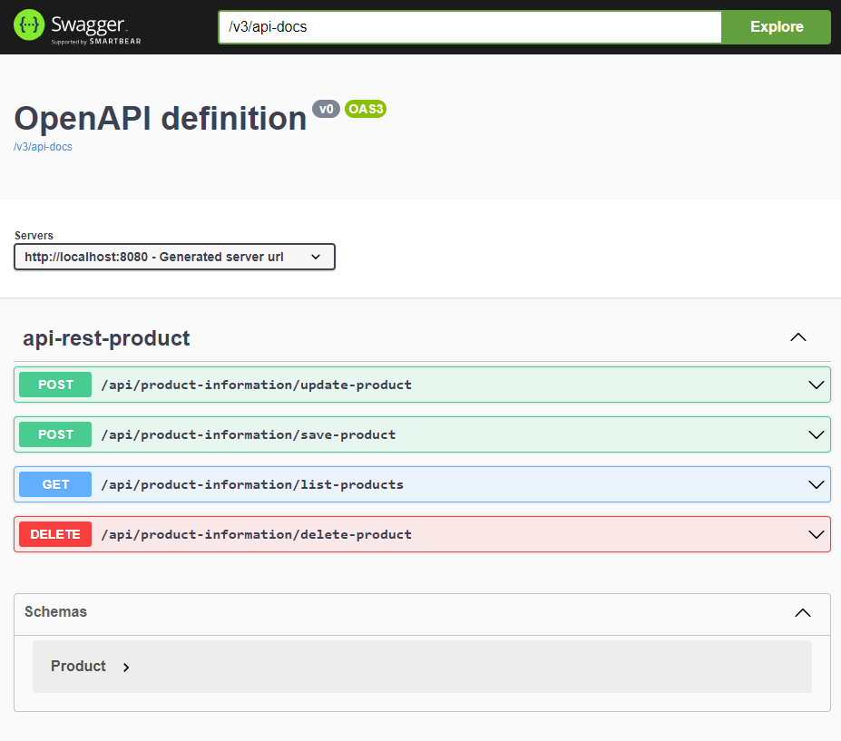
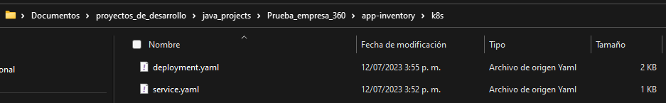
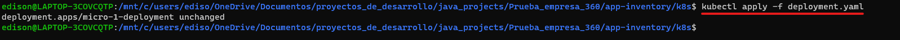
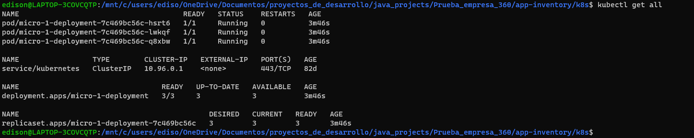

# API de Inventario y Depreciación de Activos

Este proyecto se basa en la creación de un API que ofrece una 
solución eficiente para gestionar el inventario y la depreciación de 
los activos de una compañía. La necesidad de este sistema surge de la 
importancia de llevar un control preciso de los equipos y su valor en el tiempo.

## Problema

El problema a abordar es la falta de un sistema que permita registrar,
actualizar y dar de baja los equipos de una compañía, así como calcular y 
mostrar la depreciación anual de su valor. Para ello, se requiere una solución 
que proporcione una interfaz sencilla y funcional para gestionar estos activos.

## Solución propuesta

La solución propuesta consiste en desarrollar un servicio de API que permita a 
los usuarios registrar los equipos de la compañía con información relevante, 
como número de serie, descripción, nombre, fecha de compra y valor de compra. 
Además, el sistema calculará automáticamente la depreciación anual del 4% del 
valor de cada equipo, aunque este porcentaje puede ajustarse según las reglas 
fiscales específicas.

El API proporcionará una consulta para obtener los datos básicos de un equipo, 
incluyendo su depreciación acumulada. Además, permitirá la actualización de la 
información de los equipos existentes y la posibilidad de dar de baja aquellos que
ya no están en uso.

## Tecnologías utilizadas

- Maven
- Java 19
- Spring boot 3
- Git

## Instalación y configuración

### * Instalación local

En este ejemplo se mostrará como instalar localmente el proyecto, requisitos tener instalado:
- Git
- Java 19
- Maven

### 1.	Descargar este proyecto:

Utilizar el comando de git clone, para esto debe contar con git instalado en su 
ordenador. Al ejecutar el comando se descargará una carpeta con los archivos 
necesarios para ejecutar la aplicación.

### 2.	Compilar el proyecto

Para compilar el proyecto y generar el archivo .JAR abra la carpeta que descargo en 
el paso anterior y dentro de esta carpeta ejecutar una línea de comandos, por ejemplo, 
en Windows cmd.

### 3. Luego ejecute el comando mvn package, escribiendo el comando y presionando la tecla enter.

### 4.	Ejecutar el proyecto

Al ejecutar el paso anterior se creo una nueva carpeta llamada ***“target”*** en su 
directorio, dentro de la consola anterior ejecute ahora el comando ***“cd target”*** y 
luego el comando ***“java -jar app-inventory-0.0.1-SNAPSHOT.jar”*** 

Al hacer esto se mostrará lo siguiente

Y ya tenemos el proyecto en ambiente local con Java 19, Spring, Maven y Git.

Para acceder a la documentación escriba en la barra de direcciones de su navegador
**http://localhost:8080/swagger-ui/index.html** y se debe mostrar la siguiente ventana
 si desea ver el YAML escriba en 
la barra de dirección **http://localhost:8080/v3/api-docs** 

## **Despliegue en Kubernetes**

Para desplegar esta aplicación en kubernetes puede hacer uso de los archivos en el directorio
k8s que se encuentra en este proyecto. Ejecute una consola de comando en este directorio 
y utilice los comandos de ***"kubectl apply -f deployment.yaml"*** y  ***"kubectl apply -f service.yaml"***
como se muestra a continuación.

luego puede ejecutar el comando de ***"kubectl get all"*** para ver los pods 
creados.

En este ejemplo se pueden 3 pods ya que el deployment se configuro para 
desplegar 3 replicas.

Tener en cuenta que ya se debe contar un un cluster y el cliente de k8s configurados
en su local ya que este proceso no se explica en este proyecto por que es algo aparte.
